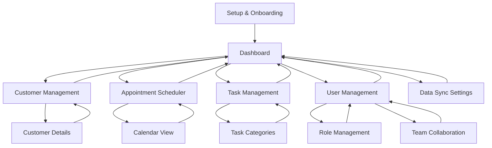

# FinCRuM Application Revamp - Product Requirements Document

## 1. Product Overview

FinCRuM (Financial Customer Relationship Management) is a comprehensive business management application that helps users manage customers, appointments, tasks, and financial data with cloud synchronization capabilities. The current application architecture has accumulated technical debt and requires a complete rebuild to provide a stable, scalable, and user-friendly experience.

**Target Market:** Small to medium businesses, freelancers, and professionals who need integrated customer and financial management with cross-device synchronization.

## 2. Core Features

### 2.1 User Roles

| Role | Registration Method | Core Permissions |
|------|---------------------|------------------|
| Admin | Cloud account owner or invited with admin privileges | Full access to all features, user management, system settings, data export, backup management, role assignment |
| Partner | Invited by admin with partner-level access | Access to customer management, appointments, tasks, reports; cannot manage users or system settings |
| Employee | Invited by admin or partner with employee-level access | Limited access to assigned customers, own appointments/tasks, basic reporting; read-only access to other data |
| Default User | Direct access (no authentication required for MVP) | Full access to all core features including customer management, appointments, tasks, and data sync |

### 2.2 Feature Module

Our revamped FinCRuM application consists of the following essential pages:

1. **Setup & Onboarding Page**: Welcome wizard, initial configuration, cloud service connections
2. **Dashboard Page**: Overview widgets, quick actions, recent activities, sync status
3. **Customer Management Page**: Customer list, add/edit customers, customer details, contact management
4. **Appointment Scheduler Page**: Calendar view, appointment creation, scheduling conflicts resolution
5. **Task Management Page**: Task lists, task creation, priority management, due date tracking
6. **User Management Page**: User roles, permissions, team collaboration, access control
7. **Data Sync Settings Page**: Cloud service configuration, sync preferences, backup management

### 2.3 Page Details

| Page Name | Module Name | Feature Description |
|-----------|-------------|---------------------|
| Setup & Onboarding | Welcome Wizard | Guide users through initial app setup, explain core features, collect basic preferences |
| Setup & Onboarding | Cloud Service Setup | Configure Google Drive and OneDrive connections, test connectivity, setup sync preferences |
| Setup & Onboarding | Data Import | Import existing data from CSV files, migrate from other systems, validate data integrity |
| Dashboard | Overview Widgets | Display key metrics, upcoming appointments, recent customers, sync status indicators |
| Dashboard | Quick Actions | Fast access to create customer, schedule appointment, add task, sync data |
| Dashboard | Activity Feed | Show recent activities, sync logs, system notifications, error alerts |
| Customer Management | Customer List | Browse all customers, search and filter, sort by various criteria, bulk operations |
| Customer Management | Customer Form | Add/edit customer details, contact information, notes, custom fields |
| Customer Management | Customer Details | View complete customer profile, interaction history, related appointments and tasks |
| Appointment Scheduler | Calendar View | Monthly/weekly/daily calendar views, appointment visualization, time slot management |
| Appointment Scheduler | Appointment Form | Create/edit appointments, set reminders, assign customers, handle recurring appointments |
| Appointment Scheduler | Conflict Resolution | Detect scheduling conflicts, suggest alternative times, manage overlapping appointments |
| Task Management | Task List | View all tasks, filter by status/priority/due date, mark complete, bulk operations |
| Task Management | Task Form | Create/edit tasks, set priorities, assign due dates, add descriptions and notes |
| Task Management | Task Categories | Organize tasks by categories, create custom labels, filter and group tasks |
| User Management | User Roles | Manage user roles (Admin, Partner, Employee), assign permissions, role-based access control |
| User Management | Team Collaboration | Invite team members, manage user accounts, shared workspace settings, user activity tracking |
| User Management | Access Control | Define data access permissions, customer assignment, appointment visibility, task delegation |
| Data Sync Settings | Cloud Configuration | Setup and manage Google Drive/OneDrive connections, test authentication, manage permissions |
| Data Sync Settings | Sync Preferences | Configure automatic sync intervals, select data types to sync, manage conflict resolution |
| Data Sync Settings | Backup Management | Create manual backups, schedule automatic backups, restore from backups, export data |
| Data Sync Settings | Export & Reports | Export customers, appointments, tasks to CSV/JSON formats, select date ranges and filters, generate basic reports and data visualization |

## 3. Core Process

### Main User Flow

1. **First-Time Setup**: User opens app → Setup wizard guides through initial configuration → Cloud services connection → Data import (optional) → Dashboard
2. **Daily Usage**: Dashboard → Quick actions or navigate to specific modules → Perform tasks → Data automatically syncs
3. **Customer Management**: Dashboard → Customer Management → Add/Edit customers → View customer details → Return to dashboard
4. **Appointment Scheduling**: Dashboard → Appointment Scheduler → Create appointment → Resolve conflicts → Save and sync
5. **Task Management**: Dashboard → Task Management → Create/manage tasks → Mark complete → Return to dashboard
6. **User Management**: Dashboard → User Management → Manage roles and permissions → Invite team members → Configure access control
7. **Data Management**: Dashboard → Data Sync Settings → Configure sync → Export data → Generate reports

### Role-Based Access Flow

- **Admin Flow**: Full access to all modules including user management, system settings, and data export
- **Partner Flow**: Access to customer management, appointments, tasks, and reports; restricted from user management
- **Employee Flow**: Limited access to assigned customers, own appointments/tasks, and basic reporting

## 4. User Interface Design

### 4.1 Design Style

- **Primary Colors**: Modern blue (#2563eb) and clean white (#ffffff)
- **Secondary Colors**: Light gray (#f8fafc) for backgrounds, dark gray (#1e293b) for text
- **Button Style**: Rounded corners (8px radius), subtle shadows, hover effects
- **Font**: Inter for UI elements, Montserrat for headings, sizes 14px-24px
- **Layout Style**: Clean card-based design, top navigation bar, sidebar for main sections
- **Icons**: Lucide React icons for consistency, minimal and modern style
- **Animations**: Subtle fade-in effects, smooth transitions (200ms duration)

### 4.2 Page Design Overview

| Page Name | Module Name | UI Elements |
|-----------|-------------|-------------|
| Setup & Onboarding | Welcome Wizard | Step-by-step progress indicator, large welcome cards, prominent "Get Started" buttons, friendly illustrations |
| Setup & Onboarding | Cloud Service Setup | Service provider cards (Google/Microsoft), connection status indicators, test connection buttons |
| Dashboard | Overview Widgets | Grid layout with metric cards, color-coded status indicators, mini charts, quick action floating buttons |
| Customer Management | Customer List | Data table with search bar, filter dropdowns, pagination, action buttons for each row |
| Customer Management | Customer Form | Clean form layout, grouped sections, validation indicators, save/cancel buttons |
| Appointment Scheduler | Calendar View | Full calendar component, color-coded appointments, time slots, drag-and-drop functionality |
| Task Management | Task List | Kanban-style boards or list view toggle, checkboxes, priority badges, due date indicators |
| User Management | User Roles | Role assignment dropdowns, permission matrix tables, user status indicators, role badges |
| User Management | Team Collaboration | User invitation forms, team member cards, activity timelines, collaboration status indicators |
| Data Sync Settings | Cloud Configuration | Toggle switches, connection status badges, sync progress bars, last sync timestamps |
| Data Sync Settings | Export & Reports | File format selection, date range picker, export progress indicators, download buttons, chart visualizations |

### 4.3 Responsiveness

The application is desktop-first with mobile-adaptive design. Touch interaction optimization is considered for tablet usage, with larger touch targets and swipe gestures for navigation.

## 5. Technical Architecture Requirements

### 5.1 Technology Stack
- **Frontend**: Next.js 14+ with TypeScript, React 18+
- **Styling**: Tailwind CSS with shadcn/ui components
- **Desktop**: Electron for cross-platform desktop application
- **State Management**: React Context API with custom hooks
- **Data Storage**: Local storage with cloud sync capabilities
- **Authentication**: OAuth 2.0 for cloud services (Google, Microsoft)

### 5.2 Performance Requirements
- Application startup time: < 3 seconds
- Page navigation: < 500ms
- Data sync operations: Background processing with progress indicators
- Offline functionality: Core features available without internet connection

### 5.3 Security Requirements
- Secure token storage for cloud authentication
- Data encryption for sensitive information
- Secure IPC communication in Electron
- Input validation and sanitization

## 6. Migration Strategy

### 6.1 Data Migration
- Export existing data from current application
- Create migration scripts for data format conversion
- Provide import functionality in new setup wizard
- Backup and rollback procedures

### 6.2 User Transition
- Gradual rollout with beta testing phase
- User training materials and documentation
- Support for running both versions during transition
- Feedback collection and issue resolution process

## 7. Success Metrics

- **User Experience**: Setup completion rate > 90%
- **Performance**: Application responsiveness < 500ms for all interactions
- **Reliability**: Sync success rate > 99%
- **Adoption**: User retention rate > 85% after 30 days
- **Quality**: Critical bugs < 1% of total features

## 8. Development Phases

### Phase 1: Foundation (Weeks 1-2)
- Setup new project structure
- Implement basic UI framework
- Create setup and onboarding flow

### Phase 2: Core Features (Weeks 3-5)
- Dashboard implementation
- Customer management system
- Basic appointment scheduling

### Phase 3: Advanced Features (Weeks 6-7)
- Task management system
- Cloud sync integration
- Data export and reporting

### Phase 4: Polish & Testing (Week 8)
- UI/UX refinements
- Performance optimization
- Comprehensive testing
- Migration tools

This revamped application will provide a solid foundation for future enhancements while addressing all current architectural issues and user experience problems.