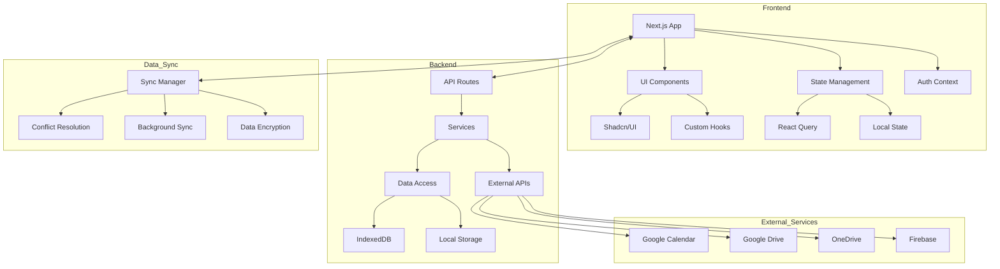
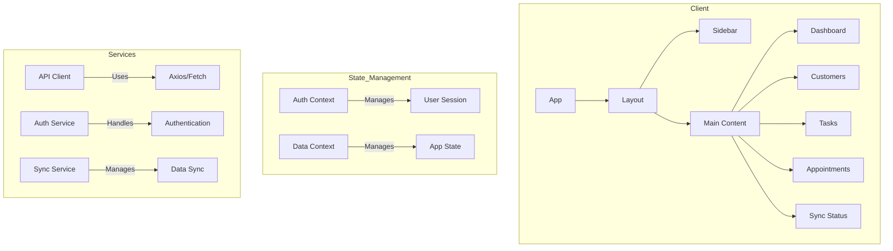

# FinCRuM (Financial Credit Risk Management) - Codebase Report

## Overview
FinCRuM is a comprehensive Financial Credit Risk Management application built with modern web technologies. The application provides tools for managing financial data, customer relationships, and risk assessment in a secure and efficient manner.

## Technology Stack

### Frontend
- **Framework**: Next.js 15.2.3 with TypeScript
- **UI Components**: Radix UI Primitives with custom styling
- **State Management**: React Context API, React Query
- **Styling**: Tailwind CSS with custom theming
- **Charts**: ApexCharts and Recharts for data visualization
- **Form Handling**: React Hook Form with Zod validation
- **Authentication**: Custom auth with PIN-based login

### Backend
- **Runtime**: Node.js
- **API**: Next.js API Routes
- **Authentication**: Custom JWT-based authentication
- **Data Storage**: Local storage with IndexedDB/WebSQL fallback
- **Data Sync**: Custom synchronization service

### Development Tools
- **Package Manager**: npm
- **Bundler**: Turbopack (via Next.js)
- **Linting**: ESLint
- **Type Checking**: TypeScript
- **Testing**: 
  - Jest with TypeScript support
  - React Testing Library
  - Custom Jest matchers
  - Mock service workers for API testing
  - Test coverage reporting

## Recent Updates (May 2024)

### Testing Infrastructure Improvements

1. **Jest Configuration**
   - Added comprehensive Jest setup with TypeScript support
   - Configured test environment for React components
   - Set up code coverage reporting
   - Added support for custom matchers and test utilities

2. **Google Calendar Service Tests**
   - Added extended test suite for Google Calendar integration
   - Implemented mock implementations for Google APIs
   - Added test coverage for authentication flows
   - Included tests for event management (create, update, delete, list)

3. **Type Safety**
   - Added TypeScript type definitions for Jest
   - Improved type safety in test files
   - Resolved type conflicts with mock implementations

4. **Test Utilities**
   - Created custom test utilities and matchers
   - Set up test environment configuration
   - Added support for testing React components

5. **CI/CD Integration**
   - Configured test results reporting
   - Set up test coverage thresholds
   - Added test result artifacts

## Complete Project Structure

```
FinCRuM/
├── backend/                 # Python backend services
│   ├── app.py              # Main FastAPI/Flask application
│   └── requirements.txt     # Python dependencies
│
├── docs/                   # Documentation
│   ├── CODEBASE_REPORT.md   # This document
│   └── blueprint.md         # Project blueprint/design
│
├── public/                 # Static assets
│   ├── favicon.ico         # Application favicon
│   └── ...
│
├── scripts/               # Build and utility scripts
│   └── ...
│
├── src/                   # Main source code
│   │
│   ├── ai/                  # AI/ML related code
│   │   ├── ai-instance.ts     # AI service instance
│   │   └── dev.ts             # Development utilities
│   │
│   ├── app/                 # Next.js App Router pages
│   │   ├── actions/           # Server actions
│   │   ├── add-customer/      # Customer addition form
│   │   ├── auth/              # Authentication pages
│   │   │   └── callback/      # OAuth callbacks
│   │   │       └── google/    # Google OAuth
│   │   │           └── page.tsx
│   │   ├── customers/         # Customer management
│   │   │   └── page.tsx
│   │   ├── data-grid/         # Data grid view
│   │   │   └── page.tsx
│   │   ├── export-data/       # Data export
│   │   │   └── page.tsx
│   │   ├── import/            # Data import
│   │   │   └── page.tsx
│   │   ├── test-calendar/     # Calendar testing
│   │   ├── test-env/          # Environment testing
│   │   ├── users/             # User management
│   │   │   └── page.tsx
│   │   ├── layout.tsx         # Root layout
│   │   └── page.tsx           # Home page
│   │
│   ├── components/          # Reusable UI components
│   │   ├── ui/                # shadcn/ui components
│   │   │   ├── accordion/     # UI components
│   │   │   ├── alert-dialog/
│   │   │   └── ...
│   │   ├── AppointmentForm.tsx  # Appointment management
│   │   ├── AppointmentList.tsx  # Appointments list
│   │   ├── CustomerDetailModal.tsx # Customer details
│   │   ├── CustomerForm.tsx    # Customer form
│   │   ├── CustomerTable.tsx   # Customers table
│   │   ├── Dashboard.tsx       # Main dashboard
│   │   ├── FileUpload.tsx      # File upload component
│   │   ├── PinLoginScreen.tsx  # PIN-based login
│   │   ├── ReminderForm.tsx    # Reminder creation
│   │   ├── ReminderList.tsx    # Reminders list
│   │   ├── SetPinScreen.tsx    # PIN setup
│   │   ├── SyncManager.tsx     # Data sync
│   │   ├── TaskForm.tsx        # Task creation
│   │   ├── TaskList.tsx        # Tasks list
│   │   ├── ThemeSwitcher.tsx   # Theme toggle
│   │   └── UserForm.tsx        # User management
│   │
│   ├── contexts/            # React contexts
│   │   └── AuthContext.tsx     # Authentication state
│   │
│   ├── hooks/               # Custom React hooks
│   │   ├── use-data-sync.tsx   # Data sync logic
│   │   ├── use-mobile.tsx      # Responsive helpers
│   │   └── use-toast.ts        # Notifications
│   │
│   ├── lib/                 # Utilities
│   │   ├── indexeddb.ts        # IndexedDB wrapper
│   │   ├── types.ts            # TypeScript types
│   │   └── utils.ts            # Helper functions
│   │
│   └── services/            # API services
│       ├── auth.ts             # Authentication
│       ├── firebase.ts         # Firebase integration
│       ├── google-calendar.ts  # Google Calendar
│       ├── google-drive.ts     # Google Drive
│       └── onedrive.ts         # OneDrive integration
│
├── .env.example              # Environment variables template
├── .eslintrc.json             # ESLint config
├── .gitignore                 # Git ignore rules
├── electron.js                # Electron main process
├── next-env.d.ts              # Next.js types
├── next.config.js             # Next.js config
├── next.config.ts             # Next.js TypeScript config
├── package.json               # NPM package config
├── postcss.config.mjs         # PostCSS config
└── tailwind.config.ts         # Tailwind CSS config
```

## Key Configuration Files

1. **package.json**
   - Main project configuration
   - Scripts for development, building, and testing
   - Dependencies management

2. **next.config.js**
   - Next.js configuration
   - Webpack and build settings
   - Environment variables

3. **tailwind.config.ts**
   - Tailwind CSS configuration
   - Theme customization
   - Plugin configurations

4. **.env.example**
   - Template for environment variables
   - API endpoints and keys
   - Feature flags

5. **electron.js**
   - Electron main process
   - Native window management
   - IPC communication

## Core Directories Explained

### 1. `/src/app`
- **actions/**: Server actions for data mutations
- **api/**: API route handlers
- **auth/**: Authentication pages and callbacks
- **customers/**: Customer management interface
- **layout.tsx**: Root layout component
- **page.tsx**: Home page component

### 2. `/src/components`
- **ui/**: Reusable UI components (shadcn/ui)
- **AppLayout.tsx**: Main application layout
- **Dashboard.tsx**: Dashboard components
- **TaskList.tsx**: Task management interface
- **UserForm.tsx**: User profile and settings form

### 3. `/src/contexts`
- **AuthContext.tsx**: Authentication state management
- **ThemeContext.tsx**: Theme and UI preferences

### 4. `/src/hooks`
- **use-auth.ts**: Authentication logic
- **use-data-sync.ts**: Data synchronization
- **use-toast.ts**: Notification system

### 5. `/src/lib`
- **config.ts**: Application configuration
- **constants.ts**: App-wide constants
- **types.ts**: TypeScript type definitions
- **utils.ts**: Utility functions

### 6. `/backend`
- **app.py**: Main FastAPI application
- **requirements.txt**: Python dependencies
- **models/**: Database models
- **routers/**: API endpoints
- **services/**: Business logic

## Key Features

### 1. Authentication & Authorization
- PIN-based authentication
- Role-based access control
- Session management
- Secure credential storage

### 2. Dashboard
- Overview of key metrics
- Interactive charts and visualizations
- Recent activities feed
- Quick action buttons

### 3. Customer Management
- Customer profiles and details
- Contact information
- Interaction history
- Document management

### 4. Data Import/Export
- CSV/Excel file import
- Data validation and mapping
- Batch processing
- Error reporting

### 5. Risk Assessment
- Credit scoring
- Risk categorization
- Automated risk alerts
- Compliance checks

### 6. Data Synchronization
- Offline-first architecture
- Conflict resolution
- Background sync
- Data encryption

## System Architecture

### High-Level Architecture



### Component Architecture



## API Documentation

### 1. Authentication API

#### Login
```typescript
// src/services/auth.ts
interface LoginCredentials {
  username: string;
  pin: string;
}

async function login(credentials: LoginCredentials): Promise<AuthResponse> {
  const response = await fetch('/api/auth/login', {
    method: 'POST',
    headers: { 'Content-Type': 'application/json' },
    body: JSON.stringify(credentials)
  });
  return response.json();
}
```

#### Session Management
```typescript
// src/contexts/AuthContext.tsx
interface AuthContextType {
  user: User | null;
  login: (credentials: LoginCredentials) => Promise<void>;
  logout: () => void;
  isAuthenticated: boolean;
  isLoading: boolean;
}

export const AuthProvider: React.FC<{ children: ReactNode }> = ({ children }) => {
  // Implementation...
};
```

### 2. Data API

#### Fetch Customers
```typescript
// src/services/api.ts
interface Customer {
  id: string;
  name: string;
  email: string;
  // ... other fields
}

async function fetchCustomers(params?: Record<string, any>): Promise<Customer[]> {
  const query = params ? `?${new URLSearchParams(params)}` : '';
  const response = await fetch(`/api/customers${query}`);
  if (!response.ok) throw new Error('Failed to fetch customers');
  return response.json();
}
```

#### Create/Update Customer
```typescript
// src/services/api.ts
async function saveCustomer(customer: Omit<Customer, 'id'> & { id?: string }) {
  const method = customer.id ? 'PUT' : 'POST';
  const url = customer.id ? `/api/customers/${customer.id}` : '/api/customers';
  
  const response = await fetch(url, {
    method,
    headers: { 'Content-Type': 'application/json' },
    body: JSON.stringify(customer)
  });
  
  if (!response.ok) {
    throw new Error(`Failed to ${customer.id ? 'update' : 'create'} customer`);
  }
  
  return response.json();
}
```

### 3. Sync API

#### Sync Data
```typescript
// src/services/sync.ts
interface SyncOptions {
  force?: boolean;
  silent?: boolean;
}

async function syncData(options: SyncOptions = {}): Promise<SyncResult> {
  const response = await fetch('/api/sync', {
    method: 'POST',
    headers: { 'Content-Type': 'application/json' },
    body: JSON.stringify(options)
  });
  
  if (!response.ok) {
    throw new Error('Sync failed');
  }
  
  return response.json();
}
```

## Key Components Documentation

### 1. Dashboard Component

```typescript
// src/components/Dashboard.tsx
interface DashboardProps {
  // Props definition
}

export default function Dashboard({}: DashboardProps) {
  // State management
  const [stats, setStats] = useState<DashboardStats>(initialStats);
  
  // Data fetching
  useEffect(() => {
    const loadData = async () => {
      try {
        const [customers, tasks, appointments] = await Promise.all([
          fetchCustomers({ limit: 5 }),
          fetchTasks({ status: 'pending' }),
          fetchAppointments({ upcoming: true })
        ]);
        // Update state...
      } catch (error) {
        console.error('Failed to load dashboard data:', error);
      }
    };
    
    loadData();
  }, []);
  
  return (
    <div className="space-y-6">
      <h1 className="text-3xl font-bold">Dashboard</h1>
      <StatsOverview stats={stats} />
      <div className="grid gap-6 md:grid-cols-2">
        <RecentCustomers customers={recentCustomers} />
        <UpcomingTasks tasks={pendingTasks} />
      </div>
    </div>
  );
}
```

### 2. Data Synchronization

```typescript
// src/hooks/use-data-sync.tsx
export function useDataSync() {
  const [isSyncing, setIsSyncing] = useState(false);
  const [lastSync, setLastSync] = useState<Date | null>(null);
  const [error, setError] = useState<Error | null>(null);

  const syncData = useCallback(async (options: SyncOptions = {}) => {
    if (isSyncing) return;
    
    setIsSyncing(true);
    setError(null);
    
    try {
      const result = await syncDataService.sync({
        force: options.force,
        silent: options.silent
      });
      
      setLastSync(new Date());
      return result;
    } catch (err) {
      setError(err instanceof Error ? err : new Error('Sync failed'));
      throw err;
    } finally {
      setIsSyncing(false);
    }
  }, [isSyncing]);

  return {
    isSyncing,
    lastSync,
    error,
    syncData,
  };
}
```

### 3. Form Handling with Validation

```typescript
// src/components/CustomerForm.tsx
import { useForm } from 'react-hook-form';
import { zodResolver } from '@hookform/resolvers/zod';
import * as z from 'zod';

const customerSchema = z.object({
  name: z.string().min(2, 'Name is required'),
  email: z.string().email('Invalid email address'),
  phone: z.string().min(10, 'Phone number is required'),
  // ... other fields
});

type CustomerFormData = z.infer<typeof customerSchema>;

export function CustomerForm({ initialData, onSubmit }: CustomerFormProps) {
  const {
    register,
    handleSubmit,
    formState: { errors, isSubmitting },
  } = useForm<CustomerFormData>({
    resolver: zodResolver(customerSchema),
    defaultValues: initialData || {},
  });

  const handleFormSubmit = async (data: CustomerFormData) => {
    try {
      await onSubmit(data);
    } catch (error) {
      console.error('Form submission failed:', error);
    }
  };

  return (
    <form onSubmit={handleSubmit(handleFormSubmit)} className="space-y-4">
      <div>
        <label htmlFor="name">Name</label>
        <input
          id="name"
          type="text"
          {...register('name')}
          className={errors.name ? 'error' : ''}
        />
        {errors.name && <span className="error-message">{errors.name.message}</span>}
      </div>
      
      {/* Other form fields */}
      
      <button type="submit" disabled={isSubmitting}>
        {isSubmitting ? 'Saving...' : 'Save Customer'}
      </button>
    </form>
  );
}
```

## Security Considerations
- Client-side data encryption
- Secure PIN storage using hashing
- Input validation and sanitization
- Rate limiting on authentication endpoints
- Secure HTTP headers

## Development Setup

1. Clone the repository
2. Install dependencies:
   ```bash
   npm install
   ```
3. Set up environment variables (.env.local)
4. Start the development server:
   ```bash
   npm run dev
   ```
5. For production build:
   ```bash
   npm run build
   npm start
   ```

## Future Improvements
- Implement comprehensive test coverage
- Add end-to-end testing
- Enhance offline capabilities
- Implement server-side rendering for better SEO
- Add audit logging
- Implement backup and restore functionality

## Dependencies
- See `package.json` for a complete list of dependencies

## License
Proprietary - All rights reserved

---
*Generated on: 2025-05-22*
*Version: 0.1.0*
